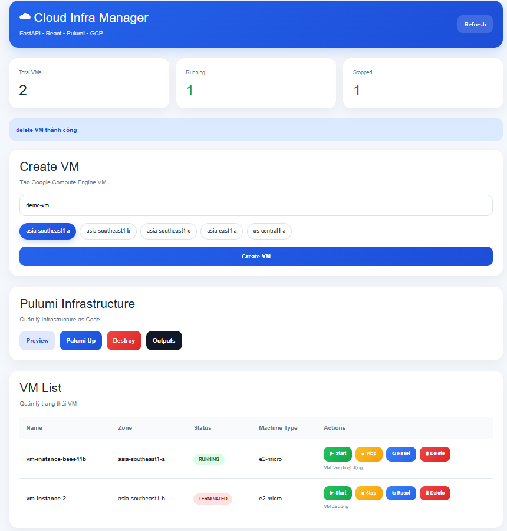
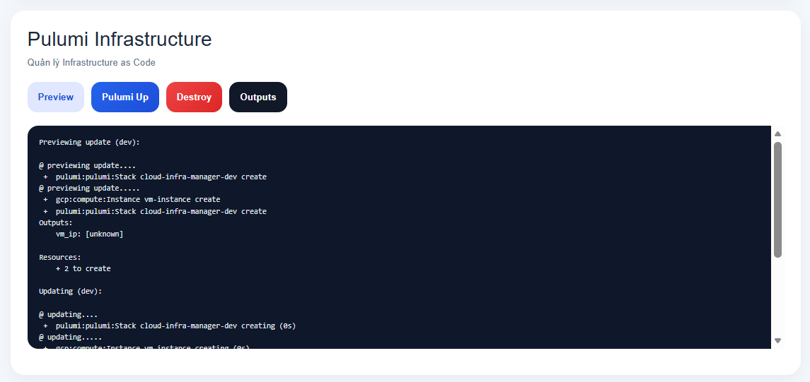

# ☁ Cloud Infra Manager


Modern cloud infrastructure management dashboard built with **React**, **FastAPI**, **Pulumi**, **Docker**, and **Google Cloud Platform**.

---

# 🚀 Features

✅ Manage Google Cloud VM instances
✅ Infrastructure as Code using Pulumi
✅ Modern React dashboard UI
✅ FastAPI backend API
✅ Docker Compose support
✅ Create / Start / Stop / Reset / Delete VM
✅ Pulumi Preview / Up / Destroy
✅ Infrastructure Outputs (Public IP)
✅ Loading overlay and real-time UI updates
✅ Automated startup script

---

# 🖼 Dashboard Preview

## Main Dashboard



---

## Pulumi Infrastructure



---

# 🏗 Architecture

```text
React Frontend
        ↓
FastAPI Backend
        ↓
Pulumi CLI
        ↓
Google Cloud Platform
```

---

# 🛠 Tech Stack

| Layer            | Technology              |
| ---------------- | ----------------------- |
| Frontend         | React + Vite            |
| Backend          | FastAPI                 |
| Infrastructure   | Pulumi                  |
| Cloud Provider   | Google Cloud Platform   |
| Containerization | Docker + Docker Compose |
| Language         | Python + JavaScript     |

---

# 📂 Project Structure

```text
cloud-infra-manager/
│
├── backend/
│   ├── app/
│   ├── Dockerfile
│   └── requirements.txt
│
├── frontend/
│   ├── src/
│   └── Dockerfile
│
├── infra/
│   ├── Pulumi.yaml
│   ├── Pulumi.dev.yaml
│   └── __main__.py
│
├── docker-compose.yml
├── start.ps1
└── README.md
```

---

# ⚡ Quick Start

## 1. Clone Repository

```bash
git clone https://github.com/teiusoa-web/cloud-infra-manager.git
cd cloud-infra-manager
```

---

## 2. Start Project

```powershell
.\start.ps1
```

This script will:

* Build Docker containers
* Start frontend and backend
* Wait for services to become healthy
* Open the frontend automatically

---

# 🌐 URLs

| Service      | URL                                                      |
| ------------ | -------------------------------------------------------- |
| Frontend     | [http://localhost:5173](http://localhost:5173)           |
| Backend API  | [http://localhost:8000](http://localhost:8000)           |
| Swagger Docs | [http://localhost:8000/docs](http://localhost:8000/docs) |

---

# ☁ Pulumi Commands

## Preview Infrastructure

```bash
pulumi preview
```

## Deploy Infrastructure

```bash
pulumi up
```

## Destroy Infrastructure

```bash
pulumi destroy
```

---

# 🐳 Docker Compose

Run full stack:

```bash
docker compose up --build
```

Stop containers:

```bash
docker compose down
```

---

# 🔑 Environment Variables

Example backend `.env`

```env
PROJECT_ID=pulumi-cloud-project
DEFAULT_ZONE=asia-southeast1-a
GCLOUD_PATH=gcloud
```

---

# 📡 API Endpoints

## VM Management

| Method | Endpoint               |
| ------ | ---------------------- |
| GET    | /vms/                  |
| POST   | /vms/create            |
| POST   | /vms/{zone}/{vm}/start |
| POST   | /vms/{zone}/{vm}/stop  |
| POST   | /vms/{zone}/{vm}/reset |
| DELETE | /vms/{zone}/{vm}       |

---

## Infrastructure Management

| Method | Endpoint       |
| ------ | -------------- |
| GET    | /infra/preview |
| POST   | /infra/up      |
| POST   | /infra/destroy |
| GET    | /infra/outputs |

---

# 📸 Example Pulumi Output

```json
{
  "vm_ip": "34.21.154.111"
}
```

---

# 🧪 Tested Environment

* Windows 11
* Docker Desktop
* Python 3.12
* Node.js 20
* Google Cloud SDK
* Pulumi CLI

---

# 🔮 Future Improvements

* Multi-cloud support (AWS / Azure)
* Authentication & JWT
* Monitoring dashboard
* Pulumi Automation API
* CI/CD pipeline
* Kubernetes deployment

---
